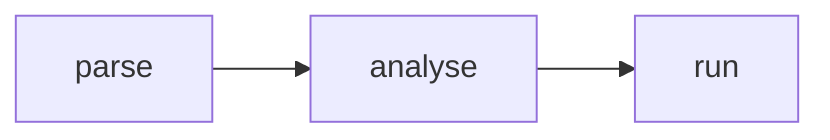

# MermaidSlate.jl 🧜

[Mermaid](https://mermaid.js.org) diagrams for [Kaimon Slate](https://github.com/kahliburke/KaimonSlate.jl) notebooks.
Text in, diagram out — which makes a diagram something you *compute*, rather than a `.png` you
maintain alongside the code it describes.

## Install

MermaidSlate is in **SlateRegistry**, so it lists in Slate's Extensions gallery and installs from the
package panel. From the REPL:

```julia
pkg> registry add https://github.com/kahliburke/SlateRegistry
pkg> add MermaidSlate
```

Or straight from this repo, no registry needed:

```julia
pkg> add https://github.com/kahliburke/MermaidSlate.jl
```

## Use

Fenced blocks in a markdown cell render in place:

````markdown

````

The same diagram is also an ordinary value, so any cell can return one — and any function can build
one:

```julia
using MermaidSlate

mermaid("flowchart LR; A --> B")

# a diagram that follows the data
stages = ["parse", "analyse", "run"]
mermaid("flowchart LR\n" * join(stages, " --> "))
```

Mermaid infers the diagram type from the first keyword, so one function covers flowcharts, sequence
and state diagrams, class and ER diagrams, Gantt charts and the rest.

### Themes

```julia
mermaid(src; theme = "forest")   # per diagram
set_theme!("neutral")            # notebook-wide default
themes()                         # ("auto", "dark", "default", "base", "forest", "neutral")
```

`"auto"` is the default and follows the notebook's light/dark setting, re-drawing when you switch.

## Notes

Nothing is vendored here. The Mermaid runtime is declared once as an import-map entry, so it's shared
by every notebook that loads the package — and an offline export inlines it, giving a self-contained
HTML file with no remote fetches. Override the build with a notebook-level `@use "mermaid" => …`.

`MermaidDiagram` deliberately has no `Base.show(::MIME"text/html")` method: outside Slate it stays a
plain value, so the same code reads normally in the REPL, IJulia and VS Code.

Built against the lean [`SlateExtensionsBase`](https://github.com/kahliburke/KaimonSlate.jl/tree/main/lib/SlateExtensionsBase)
SDK — no KaimonSlate dependency. Requires KaimonSlate ≥ 1.2.1 to install into an already-open
notebook without a reload.

Demo notebook: [`notebooks/mermaid.jl`](notebooks/mermaid.jl).
